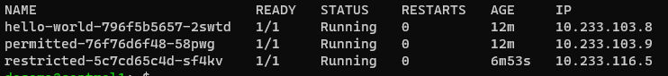
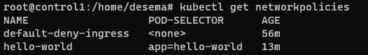
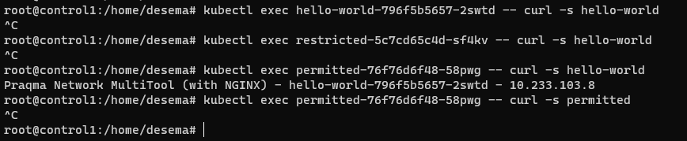
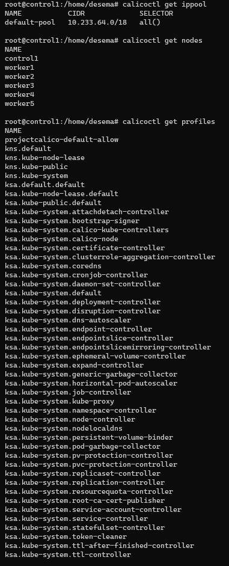

# Задание 1: установить в кластер CNI плагин Calico

Собрал кластер через kubespray. Calico по умолчанию.
  Cделал 3 деплоймента (hello-world, permitted, restricted) на базе образа praqma/network-multitool

  После этого применил две сетевых политики, [первая](default.yaml) с полный запретом, а [вторая](hello-world.yaml) разрешает ингресс от подов permitted к hello-world по порту 80.
  

 Попробовал курл в разных направлениях. убедился что политика работает корректно.

# Задание 2: изучить, что запущено по умолчанию

Поигрался с командами. заскринил 3 требуемых вывода.
 

